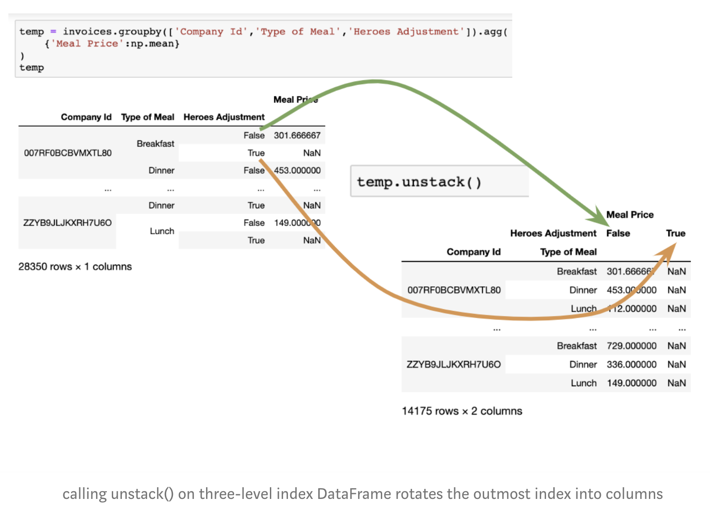

# Pandas Summary

Note: This summary is written on the basis of articles published on medium by Fabian Bosler.
- Link1: https://towardsdatascience.com/how-to-master-pandas-8514f33f00f6
- Link2: https://towardsdatascience.com/learn-advanced-features-for-pythons-main-data-analysis-library-in-20-minutes-d0eedd90d086

The thoughts of the autor are complemented by my own, however markdown does not allow to provide outputs of operations in a suitable format, thus I would advice to read the articles if further illustrations are desired.

Hint when using jupyter notebook: It's a good idea to adjust the jupyter notebook layout a little to gain more space for wider DataFrames.

```python
# Enlarge Jupyter Notebook.
from IPython.core.display import display, HTML
display(HTML("<style>.container {width:90% !important;}</style>"))
```

### Loading Data

##### Commands reading different data formats
```python
pd.read_csv()
pd.read_clipboard()

```

##### Some noteworthy parameters for the read_csv based functions (and read_clipboard)

- ```sep``` : separator for the columns (defaults to , but could also be tab)
- ```header``` : defaults to 'infer' (i.e., Pandas guesses as to what your header is), alternatives are an integer or a list of integers (for multi-level names). E.g., you could do header=3 and the dataframe would start with row 4 (because Python is 0-indexed) as the header. If your data has no header use header=None
- ```names``` : names of the columns. If you want to use this parameter to override whatever column names Pandas had inferred, you should specify header=0 (or whatever line your columns names are in), if you do not do this, you will have your names as the column names and then the original column names in the first row. The names parameter expects a list, e.g. ['your col 1', 'your col 2', ... 'your last col name']
- ```index_col``` : set’s an index on load (i.e., we set index to be name . We will learn more about indexes later)
- ```skiprows``` : skips the first x rows, this is useful when the file contains some metadata at the beginning like author and other information
- ```skipfooter``` : skips the last x rows, useful when there is metadata at the end of the file (e.g., footnotes)
- ```parse_date``` : This parameter tells Pandas, which columns it should interpret as a date (e.g. pd.read_csv(happiness_with_continent.csv,parse_dates=['Year']). The default parser works reasonably well out of the box. In cases where you encounter funky data formatting, Pandas can work with custom date parsers (for which you would have to specify the parsing logic).


##### additional readers
```python
pd.read_fwf()
pd.read_gbq()
pd.read_hdf()
pd.read_html()
pd.read_json()
pd.read_msgpack()
pd.read_parquet()
pd.read_pickle()
pd.read_sas()
pd.read_sql()
pd.read_sql_query()
pd.read_sql_table()
pd.read_stata()
pd.read_table()
```

### Inspecting/Sorting/Filtering Data

#### Inspecting

##### (1): Showing some rows

Showing the first, last or sample rows from the DataFrame.

```python
df.head()
df.tail()
df.sample()
```

##### (2): shape, columns, index, info, describe

- ```df.shape``` returns the dimensions of the DataFrame
- ```df.columns``` returns a list with the names of the columns of the DataFrame
- ```df.index``` returns some information about the indices of the DafaFrame
- ```df.info()``` returns information about data types and number of null observation in the DataFrame.
- ```df.describe()``` returns some descriptive statistical information (count, mean, median, std, min, max, quantiles) about the data.

#### Sorting

##### (1): .sort_values(by=)

parameter ```by```has to be specified with a column name or a list of column names, the df needs to be sorted by.
Setting ```ascending```is optional (default=True) and specified the order of sorting.
```python
df.sort_values(by=)

df.sort_values(by=['col1', 'col2'],
              ascending=[True, False])
```
**(!)** When using a list of columns, the order plays a role. First sorted from left to right.


##### (2): .sort_index()

Sorts the data by indices (also when indices are dates!). ```ascending``` can be specified as well (default=True).

```python
df.sort_index(ascending=False)
```

#### Filtering

##### (1): columns

```python
# Selecting one column:
df.['col']
# DO NOT USE THIS APPROACH
df.col

# Selecting multiple columns:
df.[['col1', 'col2', ...]]

```

##### (2): rows

Either one of the two following (```df.loc```, ```df.iloc```) can be used for row selection. Whereas loc accesses rows by their index name, iloc accesses rows by teir position

```python
# Accessing rows and cols.
# col_name and col_position parameters are optional (emphasized by the parenthesis).
df.loc[row_name(s) (, col_name(s))]
df.iloc[row_position(s) (, col_position(s))]
```

**Iloc:**
```python
data.iloc[start_row:end_row (,start_col:end_col)]
```

**Loc:**
One can use ```df.set_index()``` function to make the column values the index. Thus, one can search for values using ```.loc```.


Using the argument ```implace=True``` is important to change the underlying DataFrame. Otherwise, the data would be changed only for the duration of this operation.
```python
# Making column to index
data.set_index('Country name',inplace=True)

# Usage of .loc (col_label optional)
data.loc[index_label (,col_label)]

# Returning all cols of rows with index 'United States'
df.loc['United Stated']

# Returning all cols of rows with index 'United States'
# or 'Germany'
df.loc[['United States', 'Germany']]

# Returning only 'Life Ladder' col of rows with index
# 'United States' and 'Germany'
df.loc[['United Stated', 'Germany'], 'Life Ladder']

# Returning only 'Life Ladder' and 'Year' col of rows
# with index 'United States' and 'Germany'
df.loc[['United Stated', 'Germany'], ['Life Ladder', 'Year']]

# Also possible:
df.loc[['Denmark' : 'Germany'], ['Life Ladder', 'Year']]
# Returns 'Life Ladder' and 'Year' col of rows
# with indices between 'Denmark' and 'Germany'
# e.g.(Egypt, Denmark, Germany, Estinia, Equador)
# -> ordered as in DataFrame not alphabetically.

# Also, can always combine:
df.loc['United Stated'].sample(5)
```

**(!)** Loc returns the rows in the provided order, irrespective of their actual ordering when specifying with list of cols.


**Loc: Boolean/Conditional Lookup**

Imagine we have a small DataFrame with 5 rows. The indices of the rows are as follows: ```indices=['A', 'B', 'A', 'C', 'D']```.

We can now create an overlay ```overlay=[True, False, True, False, False]``` with the same length as the index list.

Now we can apply the overlay on the DafaFrame to select only the rows in the DataFrame that are marked with ```True``` in the overlay. This can be done with the ```.loc``` accessor.

```python
df.loc[overlay]
# which is the same as
df.loc[[True, False, True, False, False]]
```

**Conditionally creating an  overlay/mask**

A mask can be created for the values of any column. For example we want to filter the all countries with a 'Life Ladder' values bigger than 4. Therefore we first need to create a mask containing ```True``` for each row where the condition holds and ```False```for each row where the condition does not hold. Second we need to apply the mask as in the example above.

```python
# Creating a mask for 'Life Ladder' colums greater than 4
# and storing this mask in overlay variable.
overlay = df['Life Ladder'] > 4

# Applying overlay variable on the DataFrame.
df.loc[overlay]

# Doing all in one:
df.loc[df['Life Ladder'] > 4]
```

Working with multiple conditions:

```python
life_condition = df['Life Ladder'] > 4
year_condition = df['Year'] > 2014
gen_condition = df['Generosity'] > 0.2

df.loc[life_condition & year_condition | gen_condition]
```
**(!)** using logical AND (&) and logical OR (|) to apply conditions jointly.

**loc — advanced conditional lookup with custom formulas**

Costomized functions like anonymous ```lambda``` functions can be written and applied to the selected data with the ```.apply()``` function.

For example: We want to select the rows containing countries on the Americam continent from years that are divisible by 3.

```python
# Creating masks:
# (1) filter years that are divisible by 3:
year_cond = df['Year'].apply(lambda x: x%3 == 0)
# (2) filter continents for the ones containing 'America':
continent_cond = df['Continent'].apply(lambda x: 'America' in x)
# (3) apply both masks to the DataFrame
df.loc[year_condition & continent_condition]
```

It is also possible to apply more complex functions that are defined separately of even make API calls in the these functions to create masks to filter the DataFrame with.

### Analytical Functions

Pandas provides a wide range of predefined analytical functions. We will have a look at the ones most commonly used. Feel free however to explore further functions in the documentation. Descriptive statistical functions can be found [here](https://pandas.pydata.org/pandas-docs/stable/getting_started/basics.html?#descriptive-statistics).

**Column wise or row wise application**
Predefined analytical functions e.g. ```.sum()``` can be applied row wise (horizontally, ```axis=1```), returning a list with the sum of the values for each row, or column wise (vertically, ```axis=0```), returning a list with the sum of values for each column. By ```default: axis=0```which equals the column wise application of the functions.

##### (1) max/min

```python
# application on whole DataFrame
# returns max values of each column.
df.max()
df.min()

# application on a column
# returns the max value for the selected column.
df['col_name'].max()
df['col_name'].min()

# application on rows (here row 3 and 4)
# returns (row wise!) max values since axis=1.
df.iloc[3:5].max(axis=1)
df.iloc[3:5].min(axis=1)
```

##### (2) sum

```df.sum()``` returns the sum of the values in columns. It the column contains values of type string, like ```['Asia', 'Asia', 'Europe']```, applying ```.sum()``` will return ```'AsiaAsiaEurope'```.

##### (3) mean, median, quantile

Returns the mean, median, quantile respectively. ```df.quantile()``` has to be specified with the value of the quantile in parameter ```q=```.

```python
df.quantile(q=0.75)
# which returns q3
```

##### (4) idxmin, idxmax

When applied on the whola DataFrame, these functions return the index of the observation with the highest/lowest value for each column.

```python
df.idxmax()
# assuming countries are indices!
# returns something like this
# Year              Denmark
# Life Ladder       United States
# ...
```

### Apply/Custom Functions

##### (1) Named Functions
Names functions are introduced using the key word ```def```. A case where we apply a named functions could look like this:

```python
# Defining a more complex function
def above_1000_below_10(x):
  '''returning "above_1000", "below_10", or "mid"
  depending on the value of the argument
  if the agrument is in fact a number.'''
    try:
        pd.to_numeric(x)
    except:
        return 'no number column'

    if x > 1000:
        return 'above_1000'
    elif x < 10:
        return 'below_10'
    else:
        return 'mid'

# Applying the function on the dataset.
df['Year'].apply(above_1000_below_10)
```
**(!)** For the DataFrame to be changed, ```df['Year'] = data['Year'].apply(above_1000_below_10)```has to be used in order to assign the new values to the year column.

**(!)** Within the ```.apply()``` function, a function is called without the parenthesis.

##### (2) lambda functions
```lambda```functions are short throw-away functions that are used one time.

```python
# Example usage
# Splitting column values on whitespaces
# and keeping the last word of the result

df['Continent'].apply(lambda x: x.split(' ')[-1])
```

**(!)** When applying funcitions to a column, they go through the DataFrame row by row. When applying a function onto the whole DataFarame, the order function goes column by column. Thus, when using functions on the whole DataFarame, the ```axis``` parameter has to be set to ```1```, (```axis=1```). Also, the function has to be written a little different.

```python
def country_before_2015(df):
  '''Returns the index of the row
  when the year value is lower than 2015
  and the continent_name else.'''

    if df['Year'] < 2015:
        return df.name
    else:
        return df['Continent']

# Note the axis=1
df.apply(country_before_2015, axis=1)
```

##### (3) Combining Columns

**combining two numbers**
To combine numbers we can use the ```+```, ```-```, ```*``` or ```/``` operators.

```python
# Combining two columns with both integer values
# returns a column with the row wise sum
df['Food Orders'] + df['Drink Orders']

# Assuming the Food Orders are stored as strings
df['Food Orders'].astype(int) + df['Drink Orders']
```

**combining strings**
We use the ```+```operator to combine strings.

```python
data['Continent'] + '_' + data['Year'].astype(str)
```

**(!)** If the type of a column does not fit to the operation, we can change it using the  ```.astype()```function.


##### (4) groupby
```.groupby()``` is a very powerful tool. It allows to calculate metrics for individual groups.

```python
# Return the maximum Live Ladder value for each country.
df.groupby(['Country'])['Life Ladder'].max()

# return the index of the highest Life Ladder Value per Year
df.groupby(['Year'])['Life Ladder'].idxmax()
```
**(!)** always call ```.groupby(['col_name'])``` with a list also when only grouping by one column.


groupby also allows analysis of multy level groups

```python
# return the maximal Life Ladder value
# for each year for each country
df.groupby(['Country', 'Year'])['Life Ladder'].max()
```

We can also use named and anonymous functions instead of the predefined ones.

```python
# Return a random choosen index value
# from within the group for each group

# Using a named function
def get_random_country(group):
    return np.random.choice(group.index.values)

data.groupby(['Year','Continent']).apply(get_random_country)

# Using an anonymous function
data.groupby(['Year','Continent']).apply( \
lambda group: np.random.choice(group.index.values)
```

**(!)** groupby aggregates data such that douplicates are summarized. Thus, unless one groups by a column that contains only unique values, the function returns a smaller dataset.

##### (5) transform
Using groupby with transform allows that not only one value is returned per group, but that each data point of a group is returned with the same value calculated for the group.

```python
# Calculate the sum of Life Ladder for each country
# and return each observation with this value.
df.groupby(['Country'])['Life Ladder'].transform(sum)
#return will be like
# Denmark         24.24
# Denmark         24.24
# ...
# Germany         11.24
# Germany         11.24

# instead of

# Denmark         24.24
# United States   55.98
# ...
# Germany         11.24
```

These functions allow us to perform more complex calculations like the row wise difference between the actual values and mean by country.

```python
df['Life Ladder'] - df.groupby(['Country'])['Life Ladder'].transform(mean)
```


### Data Type Conversion

##### Existing Data Types
- ```object```: This data type is used for strings (i.e., sequences of characters)
- ```int64```: Used for integers (whole numbers, no decimals)
- ```float64```: Used for floating-point numbers (i.e., figures with decimals/fractions)
- ```bool```: Used for values that can only be True/False
- ```datetime64```: Used for date and time values
- ```timedelta```: Used to represent the difference between datetimes
- ```category```: Used for values that take one out of a limited number of available options (categories don’t have to, but can have explicit ordering)

##### Display Data Types
The ```.info()``` gives a good overview about the data and also the data types for each column.
```python
df.info()
```

##### Changing Data Types
Sometimes we want other data types then the ones given by default. For example if numeric values are given as strings which we can not use for calculations or if numeric values are given as floats but we would need integers.

**(1) astype()**
```.astype()``` is an easy and fast method to use with columns if we have clean data.

```python
df['col_name'] = df['col_name'].astype('int')
df['date_col'] = df['date_col'].astype('datetime64')
```
**(!)** ```astype``` has to be given a ```string``` as argument

**(!)** one has to be carefull unsing the ```datetime``` format with the pandas versions. Whereas pandas ```0.23.x``` dates were converted to UTC which allowed addition and other operations with dates, pandas ```0.25.x``` comes with time zone sensivity which does not allow the operations on dates any longer without some adjustments.

**(2) conversion helper functions**
For conversion one can also use helper functions like:

```python
pd.to_numeric()
pd.to_datetime()
```

Their main advantage over astype, is that it is possible to specify the behavior in case a value is encountered, that can not be converted. The functions let us specify the ```error``` parameter which defined the handling of encountered errors. One can use either ```error='ignore'```ignoring errors or ```error='coerce'``` (default) which converts error to ```np.nan```.

When encountering fraud values like strings that can not obviously be couverted into numbers, we can (1) convert the fraud values into NaN, (2) assign the median value to the NaNs and (3) convert the values into integers.

```python
# convert the offending values into np.nan
df['col_name'] = pd.to_numeric(df['col_name'],errors='coerce')
# fill np.nan with the median of the data
df['col_name'] = df['col_name'].fillna(df['col_name'].median())
# convert the column into integer
df['col_name'].astype(int)
```

The function ```.fillna()``` takes the values given as an argument and fills NaN values with the passed argument.

```pd.to_datetime()```

converts values into date time format and does very well. A list of possible conversions can be found below:


```python
print(pd.to_datetime('2019-8-1'))
print(pd.to_datetime('2019/8/1'))
print(pd.to_datetime('8/1/2019'))
print(pd.to_datetime('Aug, 1 2019'))
print(pd.to_datetime('Aug - 1 2019'))
print(pd.to_datetime('August - 1 2019'))
print(pd.to_datetime('2019, August - 1'))
print(pd.to_datetime('20190801'))

# will be converted #
# 2019-08-01 00:00:00

# When encountering some unusual formats,
# we can customize the function as
pd.to_datetime('20190108',format='%Y%d%m')

# We can also search for a date format in the given strings
# Obviously this would normally not work
pd.to_datetime('yolo 20190108', format='%Y%d%m')

# We can use the exact parameter to make it work
pd.to_datetime('yolo 20190108', format='%Y%d%m', exact=False)
```

**(!)** using the ```utc=True``` parameter, dates get assigned in utc time zone format allowing the calculations with dates also in pandas ```0.25.x```.

### Accessors
Think of a Pandas accessor as a property that acts as an interface to methods specific to the type you are trying to access. These methods are highly specialized but do a really good job.

##### (1) ```dt``` accessor
- ```date``` returns the date of the datetime value
- ```weekday_name``` returns the name of the day
- ```month_name()``` returns the name of the month. **(!)** carefull with the parenthesis, inconsistency
- gets the integer of the corresponding frequency.
  - ```nanosecond```
  - ```microsecond```
  - ```second```
  - ```minute```
  - ```hour```
  - ```day```
  - ```week```
  - ```month```
  - ```quarter```
  - ```year```
- returns True or False respectively for each value. can be used as filters
  - ```is_leap_year```
  - ```is_month_start```
  - ```is_month_end```
  - ```is_quarter_start```
  - ```is_quarter_end```
  - ```is_year_start```
  - ```is_year_end```
- ```to_pydatetime()```, which converts the Pandas datetime into a regular Python datetime format (which you might need sometimes)
- ```to_period(<PERIOD>)``` [available periods are W, M, Q, and Y], which converts the dates into periods

##### (2) ```str``` accessor
Enables good functionalities when dealing with strings

- ```lower()``` returns lower case string
- ```upper()``` returns upper case string
- all of the following take the total desired width of the string as input
  - ```ljust(width)``` fills the distance to the length with right whitespaces (left bound)
  - ```rjust(width)``` fills the distance to the length with left whitespaces (right bound)
  - ```center(width)``` fills the distance to the length with left and right whitespaces
  - ```zfill(width)``` fills the distance to the length with left zeros
- checks for the presence of a substring returning true or false
  - ```startswith(<substring>)```
  - ```endswith(<substring>)```
  - ```contains(<substring>)```
- for kicks and giggles
- ```swapcase()``` swapps cases from upper to lower and vice-versa
- ```repeat(times)``` returns a string containing the imputstring repeated n times

##### (3) ```car```accessor
Provides access to categorical data. Therefore, data has to be marked as categorical in advance.

- ```ordered``` lets you know if the column is ordered, returns boolean
- ```categories``` returns the categories
- ```codes``` converts categories into their numerical representation **(!)** alternative to LabelEncoder
- ```reorder_categories``` changes the existing order of the categories

### Combining  DataFrames

##### Concatinating

** (1) vertical stacking**
Vertical stacking (Union in Alteryx) means that two or more DataFrames are stacked on top of each other. How the stacking is done in particular can be specified with the parameters.

Lets assume we have three datasets for 2017, 2018, 2019 called the ```df_2017```, ```df_2018```, ```df_2019```. They contain the same features collected in different years and we would like to concatinate the DataFrames to one DataFrame.

```python
# stacking DataFrames on top of each other
new_df = pd.concat([df_2017, df_2018, df_2019])
```

```pd.concat``` takes optional arguments to finetune the concatination.
- ```axis```
  - (default: ```0```)
  - ```0``` = vertical stacking
  - ```1``` = horizontal stacking
- ```join```
  - default = ```outer```
  - ```inner``` for intersection
  - ```outer``` for union of indices of non-concatinating axis.
- ```ignore_index```
  - default: ```False```
  - when ```True``` preexisting indices are ignored and new indices from 0 to n-1 are reassigned.
- ```keys```
  - default: ```None```
  - construction of hirarchical index. Given in a list containing one index for each concatinated DataFrame.
  - best used with ```names```
- ```names```
  - default: ```None```
  - list with index names assigned to later indices.

** (2) horizonzal stacking**
Having two time series, each containing data from different periods which are overlapping. Thus we can stack the time series horizontally on the fitting indices. Using the ```join='inner'```, the resulting DataFrame will only contain the observations of both DataFrames in the overlapping period. Using the ```join='outer'``` results in a DataFrame consisting of the whole time period spanned by both input frames, filled with ```NaN``` where no data is available.

For this operation, the ```axis``` parameter has to be set to ```1```.

**(!)** The ```df.append()``` delivers horizontal stacking functionallity as well. However since ```pd.concat()``` includes its functionallity and performs the same, it is not recommended to use ```.append()```.

```python
# Example usage
# Returns outer join
pd.concat([df_1, df_2], axis=1, join='outer')
```

##### Merging
Whereas concatinating is used when two quite similar datasets are joint to gather the information in one large dataset, merging is used when come pieces of information com from one dataset and some other information from another dataset and we would like to merge them together in a dataset.

As an example, imagine you have two datasets, one containing employee_name and location_id, and another one containing location_id and city_name. But you want to have employee_name and city_name together in one DataFrame. However, merging is also used on pseudonymized data.

Here, an overview of possible options for the ```pd.merge``` operation are given.

```python
pd.merge(
 left,
 right,
 how='inner',
 on=None,
 left_on=None,
 right_on=None,
 left_index=False,
 right_index=False,
 sort=True,
 suffixes=('_x', '_y'),
 copy=True,
 indicator=False,
 validate=None
) -> pd.DataFrame
```

- ```left```/```right``` : the left, respectively right, DataFrame you want to merge
- ```how``` : 'left', 'right', 'outer', 'inner' (default).
- ```left_index```/```right_index``` : If ```True```, use the index from the left/right DataFrame to merge on. ```default = False```
- ```on``` : Column name(s) to merge on. Column name(s) have to exist in both the left and right DataFrame. If not passed and left_index and right_index are False, the intersection of the columns in both DataFrames will be inferred to join on.
- ```left_on```/```right_on``` : Column name(s) from the left/right DataFrame to join on. Typical use case: Keys you are joining on are differently labeled in your DataFrames. E.g., what is location_id in your left DataFrame, might be _id in your right DataFrame. In this case, you would do left_on='location_id', right_on='_id' .
- ```suffixes```: A tuple of string suffixes to apply to overlapping columns. suffixes defaults to ('_x', '_y'). ('_base', '_joined') are recommended.

**(!)** There is also the ```pd.join()``` operation. But as in the case with ```df.append()``` and ```pd.concat()```, join is just a special case of merge and thus not recommended to use.

##### Map
Mapping can be used when the values of a series shall be merged on a DataFrame. Therefore, the argument used with the map function has to be a ```pandas.Series``` and the indices of the Series will be used as merge column with the fitting column in the DataFrame.

```python
# Creating series to map
lookup = df.set_index('key_col_name')['val_col_name']

# mapping the series to the DataFrame
df1['new_col_name'] = df1['join_col_name'].map(lookup)
```

**(!)** Series are quite similar to python dictionaires. One can also iterate through a series using for k,v in series.items():


### Reshaping DataFrames

##### Transpose
Transposing a DataFrame means to swap rows and columns, turning a mxn DataFrame into a nxm DataFrame without changing any values.

```python
# Transposing a dataframe
df.T
```


##### Melting

```melt``` is useful to transform a DataFrame into a format where one or more columns are identifier variables (```id_vars```), while all other columns, considered measured variables (```value_vars```), are moved to the row axis, leaving just two non-identifier columns. For each column we melt (```value_vars```), the corresponding existing row is duplicated to accommodate fusing data into a single column and our DataFrame extends. After melting, we have X times as many rows as before (because we used X ```value_vars``` and thus multiplied every row with X).

```python
# While cols that are defined as id_vars stay unchanged,
# the cols declared as val_vars melt together to one column.
pd.melt(
    frame=df,
    id_vars=['col_1', 'col_2', ...],
    value_vars=['col_n', 'col_n+1', 'col_n+2'],
    var_name='key_col',
    value_name='value_col'
)
```

##### Groupby (again)

In the light of stacking and unstacking indices new possibilities for the ```df.groupby()``` function are generated. Whereas ```transpose``` and ```melt``` only rearrange values, ```groupby``` and the following ```pivot``` aggregate data.

If grouping a DataFrame by more than one value ```df.goupby(['col1', 'col2', ... ])``` the resulting DataFrame will have multi-index.

```python
# Grouping by two columns and aggregating data as mean per group.
invoices.groupby(['col_1','col_2']).agg(
    Avg_Value = pd.NamedAgg(column='col_name', aggfunc=np.mean)
)

# Same result can also be achieved using the following
invoices.groupby(['col_1','col_2']).agg(
    {'Avg_Value':np.mean}
)
```

##### Pivot

Pivot Tables generate similar outcome like groupby operations but can provide additional value through its ```margin=True``` parameter that row-wise and column-wise sums up values in the pivot table.

A table similar to the one we just built with ```groupby``` can be generated as follows. Except that we can put ```marging=True```providing some additional information.

```python
pd.pivot_table(
    df,
    index=['col_1','col_2'],
    values='Avg_Value',
    aggfunc=np.mean,
    margins=True
)
```


##### Stacking and Unstacking
Stack and unstack come in really handy when rearranging your columns and indices. Unstack will by default be called on the outmost level of the index as can be seen nicely in the following example, where calling unstack() turns the Heroes Adjustment Index into two columns.




The level of index to stack/unstack can be specified.

```python
# Unstack/Stack by column name
df.unstack(level='col_name')
df.stack(level='col_name')

#Unstack/Stack by level of index, outmost = 0, inner = n
df.unstack(level=1)
df.stack(level=1)
```

**(!)** Stacking means to stack on the index side, unstacking means to stack on the column side.

If there is a multi-column DataFrame, we can call ```df.stack()``` to stack the column labels. Default level is ```0```. With ```df.stack(n)``` we can also specify the level to be stacked.
